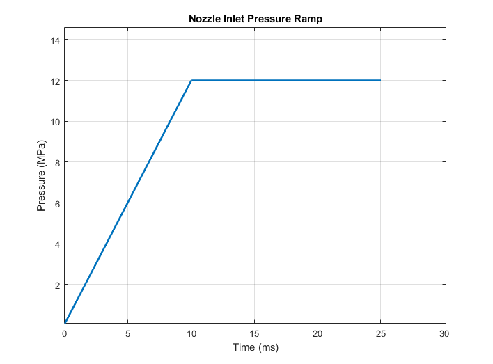
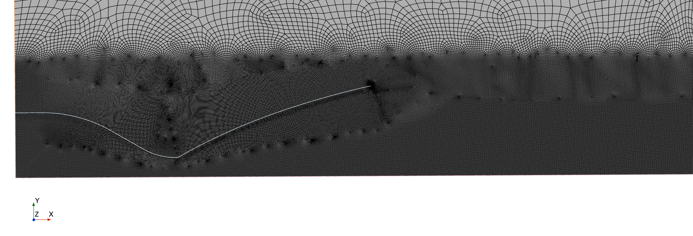

## Transient Rocket Nozzle vs. Steady-State — Why 0.70 MN vs 1.10 MN

**The transient run plateaus around **0.70 MN** while the steady-state solution predicts **~1.10 MN**.  
That gap is expected during startup because the nozzle flow hasn’t fully “settled” to the design exit conditions.

**Thrust definition**
\[
F(t)=\underbrace{\dot m(t)\,V_e(t)}_{\text{momentum flux}}
+\underbrace{\big(p_e(t)-p_\infty\big)\,A_e}_{\text{pressure term}}
\]
(Exit-plane values, \(p_\infty\) = ambient.)

---

### Species breakdown (what the “Species (Air)” field shows)
- **Inside the nozzle:** Air mass fraction ≈ 0 (combustion products dominate in the model).  
- **Plume mixing region:** Air fraction rises from 0 → 1 with radius; a thicker mixed layer early in time = more entrainment = lower thrust.  
- **Cold core note:** The centerline can look “cold” (e.g., ~270 K) right after the exit due to rapid expansion.
---

### Mesh & pressure ramp
**Pressure ramp used in the transient:**

**2D axisymmetric mesh:**

Key settings: Δt = 1e−6 s, total simulated time = 0.025 s, implicit transient, ~25 inner iterations/step.

---

1. **Run past the ramp:** Continue until \(\dot m(t)\) and \(p_e(t)\) flatten for several ms; then time-average thrust.
2. **Compute thrust at the exit plane:** Use area-weighted \(\dot m\), \(V_e\), and \(p_e\); subtract \(p_\infty A_e\). Avoid “net wall force only” during transients.
3. **Smooth the signal:** Moving average over 1–5× the acoustic transit time of the nozzle to remove shock flapping.
4. **Domain & outlet:** Ensure far-field is large and non-reflecting; \(p_\infty\) in transient matches the steady case.

**Expectation:** Once the ramp completes and the exit plane stabilizes, the transient time-average should rise toward the steady ≈1.1 MN (within modeling error). If it doesn’t, the exit is likely still over/under-expanded or the averaging window is too short.

### Mach
<video controls muted playsinline loop style="max-width:100%;height:auto;">
  <source src="Media/Mach.mp4" type="video/mp4">
</video>

### Species (Air)
<video controls muted playsinline loop style="max-width:100%;height:auto;">
  <source src="Media/SpeciesAir.mp4" type="video/mp4">
</video>

### Temperature
<video controls muted playsinline loop style="max-width:100%;height:auto;">
  <source src="Media/Temp.mp4" type="video/mp4">
</video>

### Velocity
<video controls muted playsinline loop style="max-width:100%;height:auto;">
  <source src="Media/Velocity.mp4" type="video/mp4">
</video>
