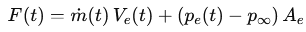
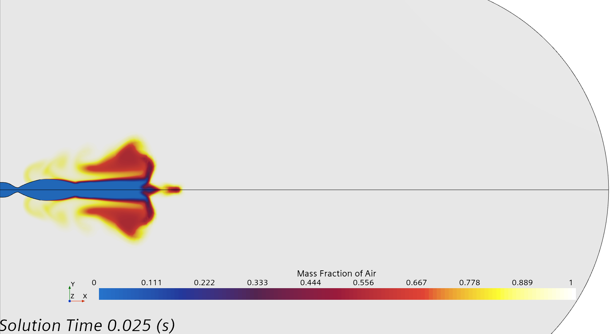
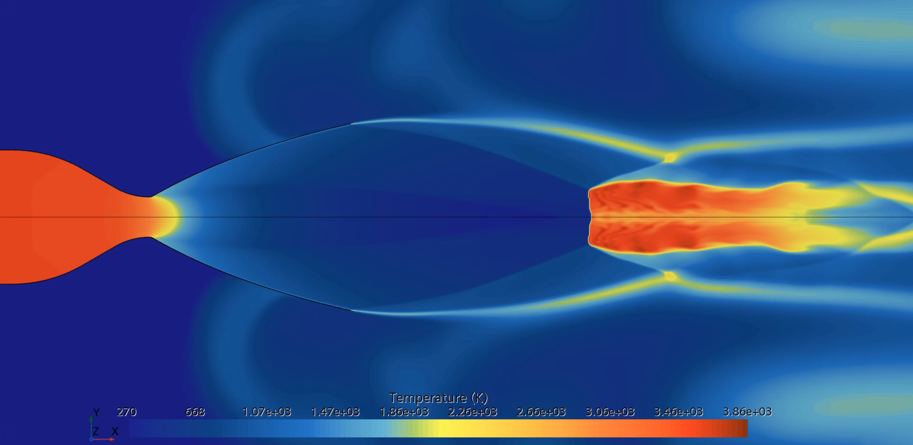

## Transient Rocket Nozzle vs. Steady-State

**The transient run plateaus around **1.1 MN** which matches the steady-state solution predicts.  
Transient simulation was stopped at 0.025 seconds run time.

**Thrust definition**

## Geometry

**Inspiration:** Based on the “Design and analysis of morphing rocket nozzle for thrust vector control” concept on GrabCAD, but morphing/TVC was intentionally removed for this exercise. The model here is a fixed, 2D axisymmetric bell nozzle sized for clarity and repeatability. exit diamter: 1.24 meters  
Reference: https://grabcad.com/library/design-and-analysis-of-morphing-rocket-nozzle-for-thrust-vector-control-1

**Coordinate system:** Axisymmetric (x along centerline, r radial).

### Simplifications vs. the morphing concept
- **2D axisymmetric**: captures startup physics (shock/expansion pattern and plume development).

### Species breakdown
- **Initial Condition** Air mass fraction ≈ 1 in entire domain.  

### Exhaust Species Breakdown (mass fraction) RP-1/LOX fuel

| Species           | Formula | Fraction | Percentage |
|-------------------|:------:|--------:|-----------:|
| Water             | H₂O    | 0.291   | 29.1%      |
| Carbon Dioxide    | CO₂    | 0.227   | 22.7%      |
| Carbon Monoxide   | CO     | 0.056   | 5.6%       |
| Hydrogen          | H₂     | 0.048   | 4.8%       |
| Oxygen            | O₂     | 0.007   | 0.7%       |
| Nitrogen          | N₂     | 0.371   | 37.1%      |
| **Total**         | —      | **1.0** | **100%** |

---

### Mesh & pressure ramp
**Pressure ramp used in the transient:**

**2D axisymmetric mesh:**

Wall Y+ hits exactly 1 at the nozzle exit last cell
K-omega SST turbulence model was used for this exersize
Key settings: Δt = 1e−6 s, total simulated time = 0.025 s, implicit transient, ~25 inner iterations/step.

---

**Thrust was computed at the exit plane:** area-weighted Mdot, Velocity, and Pressure; subtract P_infinity.
**Domain & outlet:** Ensure far-field is large and non-reflecting.

**Expectation:** Once the ramp completes and the exit plane stabilizes, the transient time-average should rise toward the steady ≈5.7 MN.

### Mach
<video controls muted playsinline loop style="max-width:100%;height:auto;">
  <source src="Media/Mach.mp4" type="video/mp4">
</video>

### Species (Air)
<video controls muted playsinline loop style="max-width:100%;height:auto;">
  <source src="Media/SpeciesAir.mp4" type="video/mp4">
</video>

### Temperature
<video controls muted playsinline loop style="max-width:100%;height:auto;">
  <source src="Media/Temp.mp4" type="video/mp4">
</video>

### Velocity
<video controls muted playsinline loop style="max-width:100%;height:auto;">
  <source src="Media/Velocity.mp4" type="video/mp4">
</video>

> **Having trouble playing the videos on GitHub?**  
> Watch the demo on Reddit:  
[Watch the video on Reddit »](https://www.reddit.com/r/CFD/comments/1mm4p5g/transient_rocket_simulation/?new_reddit=true)
> Videos available on request.
